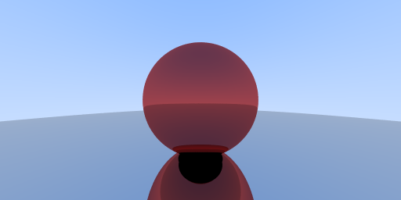
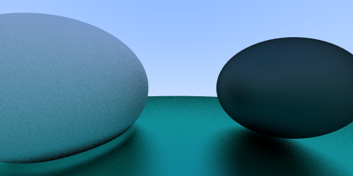
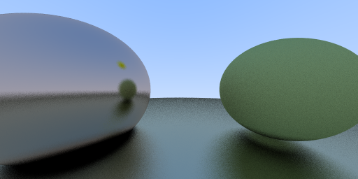
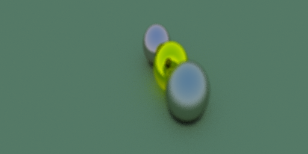

## RAY TRACING IN ONE WEEKEND
From the book of the same name [here](https://github.com/RayTracing/InOneWeekend) or [here](http://www.realtimerendering.com/raytracing/Ray%20Tracing%20in%20a%20Weekend.pdf)

### Outputs
Sphere colored with normal vectors.

Sphere with diffuse/lambertian coloring 

Sphere with metallic reflection

Several spheres with different material properties

Some spheres, some with dielectric properties.

Camera focus and position

